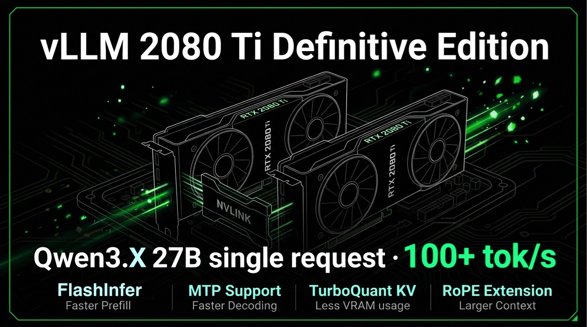
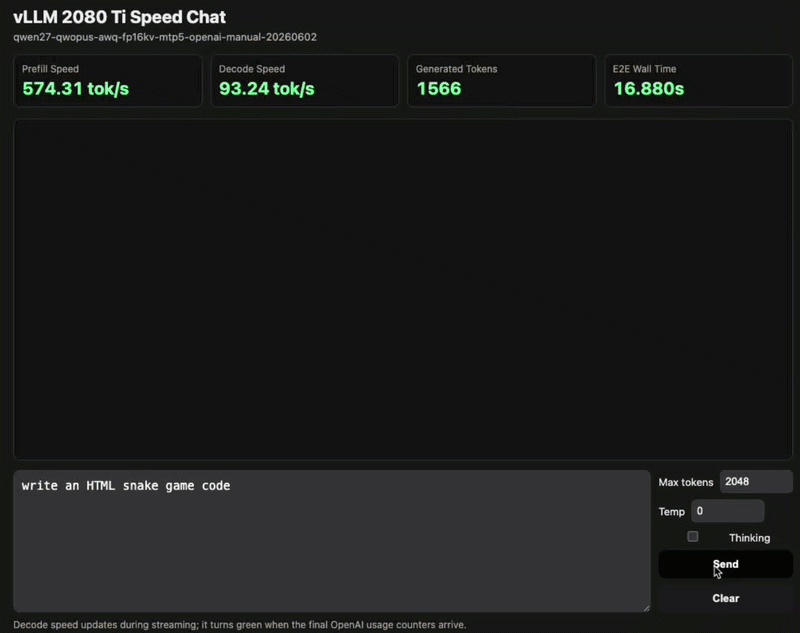

<!-- markdownlint-disable MD001 MD041 -->
# vLLM 2080 Ti Definitive Edition



Hardware-focused vLLM fork for dual RTX 2080 Ti 22 GB / SM75 serving. This
branch is the isolated `0.2.1-pre` migration to upstream vLLM `v0.27.1`, CUDA
13.0, and PyTorch 2.13. It is not yet a published runtime release.

This project preserves the SM75-specific source changes, launcher profiles,
and benchmark evidence needed to reproduce the dual-2080-Ti TP=2 stack. It is
based on upstream vLLM; retain both the upstream license and attribution to
`github.com/weicj` when redistributing a derivative.

Language: English | [Simplified Chinese](README.zh-CN.md)



Fork release: `0.2.1-pre`
Base vLLM: `0.27.1`

## Why RTX 2080 Ti For LLM Inference?

The project is built around a practical cost/performance premise: two 22 GB
RTX 2080 Ti cards joined by NVLink provide 44 GB of VRAM, substantial memory
bandwidth, and 136 Turing SMs. With an SM75-aware vLLM route, that is enough
for serious local 27B and 35B-class serving rather than only small-model use.

| Metric | 2x RTX 2080 Ti 22 GB + NVLink | RTX 3090 Ti 24 GB baseline | Ratio |
| --- | ---: | ---: | ---: |
| Physical CUDA cores | 8,704 | 5,376 | 1.62x |
| SM count | 136 | 84 | 1.62x |
| Physical Tensor Cores | 1,088 | 336 | 3.24x |
| Dense FP16 matrix throughput | 228 TFLOPS | 160 TFLOPS | 1.43x |
| Total memory bandwidth | 1,232 GB/s | 1,008 GB/s | 1.22x |
| Total VRAM | 44 GB | 24 GB | 1.83x |

The fork turns those hardware properties into a usable serving stack through
Marlin, FlashInfer/FlashQLA, TurboQuant/INT8 KV, MTP, and CUDA Graph support.

## Status

The `0.2.1-pre` target is Ubuntu 26.04 or later, Linux kernel 7 or later,
GCC/G++ 15, CUDA 13.0, and PyTorch 2.13. The maintained `v0.1.x` branch remains
the compatibility route for CUDA 12.8 and PyTorch 2.11.

The dual-2080-Ti CUDA Graph validation is recorded in
[the migration report](docs/2080ti-0.2.1-pre-validation.md). It includes the
exact host selection rule, build gate, correctness regressions, and 4K/128
benchmark method. Do not treat a checkpoint that merely loads as a promoted
deployment route.

## Core Routes

Serving shape:

- The target is extreme single-concurrency serving: one personal-agent style
  workload, one serious 27B or 35B model, and the largest practical context
  window this hardware can sustain.
- This is not a multi-tenant serving cluster. Long-prefill work is
  capacity-safe when tuned, but is effectively serialized by the TP=2 runtime
  scheduler.

Status: validated means evidence exists for the stated route; experimental
means partial or historical evidence; unsupported means a known missing path.

### Qwen3.8 27B

Qwen3.8 27B is the active `0.2.1-pre` SM75 validation lane. The official FP8
checkpoint runs TP=2 on the NVLink pair through the Marlin weight-only path,
FP16 KV cache, FlashInfer/FlashQLA attention, and CUDA Graphs. The current
candidate checkpoint outcomes are listed below; exact benchmark evidence and
limitations belong in the [migration report](docs/2080ti-0.2.1-pre-validation.md).

The broader Qwen3.x 27B feature surface below is retained from the mature
`v0.1.x` profile line. It is compatibility evidence, not a declaration that
every row has already been promoted to CUDA 13.

| Feature | FP16 KV | INT8 KV | TurboQuant KV |
| --- | --- | --- | --- |
| Marlin weight route | Validated FP8/INT4/NVFP4 | Validated FP8/INT4/NVFP4 | Validated FP8/INT4/NVFP4 |
| MTP decoding | Validated | Validated | Validated |
| Native 256K context | Validated | Validated | Validated |
| YaRN extension | Not a target route | Validated | Not a target route |
| Non-eager / CUDA Graph | Validated | Partial | Validated |
| Fast prefill route | FlashQLA / FlashInfer | FlashQLA / FlashInfer | FlashQLA / FlashInfer |
| Multimodal image serving | Validated | Validated | Validated |
| Profile status | normal / fast / safe | normal / safe | fast |

### Qwen3.x 35B FP8

The FP8 35B routes are retained from the validated `v0.1.x` dual-2080-Ti
profile set. They remain useful compatibility references, but require separate
cu130 revalidation before being promoted as `0.2.1-pre` deployment presets.

The retained set covers FP16-KV 256K text-only `normal` / `aggressive`,
FP16-KV 136K text-and-image `normal` / `aggressive`, and a 178K `fast` MTP3
profile.

### Gemma4 Baseline Support

Gemma4 has baseline model/runtime support in this tree. It is not part of the
current `0.2.1-pre` SM75 promotion set. Checkpoint forms, MTP requirements,
KV-cache limits, multimodal status, and the distinction between historical and
cu130 evidence are documented in [Gemma4 SM75 support notes](docs/gemma4-sm75-support.md).

## Tested Model Checkpoints

This is the intentionally narrow `0.2.1-pre` checkpoint list. "Validated"
means the stated normal/fast short route completed on the physical dual 2080
Ti NVLink pair; it does not claim all contexts, KV dtypes, or MTP settings.
The 35B row is retained `v0.1.x` evidence and is explicitly not cu130
promotion evidence.

| Model route | Weight route | Model cards | Status |
| --- | --- | --- | --- |
| Qwen3.8 27B | FP8 | [Qwen/Qwen3.8-27B-FP8](https://huggingface.co/Qwen/Qwen3.8-27B-FP8) | Validated on the `0.2.1-pre` FP16-KV CUDA Graph route |
| Qwen3.8 27B | NVFP4 | [pottokao/Qwen3.8-27B-NVFP4-MTP-2x16GB](https://huggingface.co/pottokao/Qwen3.8-27B-NVFP4-MTP-2x16GB) | Validated, normal and fast short routes |
| Qwen3.8 27B | INT8 W8A8 | [RukaRat/Qwen3.8-27B-INT8-W8A8-imatrix-MTP](https://huggingface.co/RukaRat/Qwen3.8-27B-INT8-W8A8-imatrix-MTP) | Validated, normal and fast short routes |
| Qwen3.x 35B | FP8 | [Qwen/Qwen3.6-35B-A3B-FP8](https://huggingface.co/Qwen/Qwen3.6-35B-A3B-FP8)<br>[Jackrong/Qwopus3.6-35B-A3B-Coder-FP8](https://huggingface.co/Jackrong/Qwopus3.6-35B-A3B-Coder-FP8)<br>[kyr0/Ornith-35B-FP8-E4M3-MTP](https://huggingface.co/kyr0/Ornith-35B-FP8-E4M3-MTP) | Validated on `v0.1.x`; cu130 revalidation pending |

## Build And Launch

Clone this repository and use the migration build entry point:

```bash
git clone https://github.com/weicj/vLLM-2080Ti-Definitive.git
cd vLLM-2080Ti-Definitive
git switch migration/0.2.1-pre-v0271
./build.sh
```

`build.sh` creates `.venv`, installs the target dependencies, compiles the CUDA
extensions, and records the build output under `build-logs/`. It fails closed
when the target compiler, kernel, or CUDA requirements are not met. Its default
parallelism is selected from the host CPU and memory; set `MAX_JOBS` or
`BUILD_MAX_JOBS` only to deliberately override that choice.

After a successful build, start and manage the service through the launcher:

```bash
./launcher.sh
```

The interactive launcher selects the checkpoint, profile, mode, GPU/TP
devices, port, service scope, chat template, reasoning defaults, and tool
calling settings. It also shows the service status, PID, API URL, log path,
prefix-cache state, and reported cache capacity. Select the checkpoint path
separately from the profile and pin the physical 2080 Ti pair with
`CUDA_DEVICE_ORDER=PCI_BUS_ID` before selecting GPU IDs on mixed-GPU hosts.

```bash
CUDA_DEVICE_ORDER=PCI_BUS_ID \
MODEL_DIR=/path/to/checkpoint \
PROFILE=qwen27b/fast/fp8/fp16kv-112K-mtp3-text-only.env \
MODE=fast GPU_DEVICES=4,5 TP_SIZE=2 \
NON_INTERACTIVE=1 ./launcher.sh
```

Profiles contain route parameters only. Their capacity and historical
throughput records are described in [profiles/README.md](profiles/README.md).
Use `launcher.sh --print-config` before starting a modified route.

## Profiles

Start with [the Profile Guide](profiles/README.md). Profiles use the layout
`profiles/<model>/<mode>/<weight>/<route>.env`; for example,
`qwen27b/normal/int4/fp16kv-256K-mtp3-text-only.env`,
`qwen35b/aggressive/fp8/fp16kv-256K-nomtp-text-only.env`, and
`qwen35b/normal/fp8/fp16kv-136K-nomtp-text-image.env`.

Available modes:

- `normal`: stable daily deployment mode.
- `fast`: higher-performance mode, to be used only with a validated route.
- `aggressive`: highest-performance mode with increased quality risk.
- `safe`: conservative fallback for troubleshooting and compatibility.

The profile selects only route parameters. The launcher owns GPU selection,
port, model path, chat template, and reasoning defaults.

## MTP And KV Precision

Use a shipped profile before hand-tuning MTP and KV settings. Choose KV by
intent: FP16/default KV for output quality, INT8 KV for balanced long-context
service, and TurboQuant K8V4 for compressed fast routes. MTP gains depend on
acceptance rate, so a synthetic peak must be checked against real output and
the profile's quality probe.

For the current migration, use the exact method and measurements in
[the validation report](docs/2080ti-0.2.1-pre-validation.md), especially for
TurboQuant and MTP3. Historical profile capacities are not cu130 evidence.

## Hardware Target

- Two RTX 2080 Ti 22 GB GPUs connected by NVLink
- NVIDIA Turing / SM75, tensor parallel size 2
- `0.2.1-pre` target: CUDA 13.0, PyTorch 2.13, Python 3.12
- Target host: Ubuntu 26.04 or later, Linux kernel 7 or later, GCC/G++ 15

Other Turing cards need independent validation for VRAM capacity, PCIe/NVLink
topology, model head dimensions, KV-cache dtype, and CUDA Graph behavior.

## Hardware Q&A

**What GPU interconnect is required?**

NVLink is recommended. PCIe P2P is the baseline requirement, but narrow PCIe
links without NVLink are not a proven substitute for the validated topology.
Confirm P2P and benchmark the actual host topology before treating it as a
deployment route.

**Does the host need a strong CPU or a lot of RAM?**

A high-end CPU is not required, but modern single-core performance and low
platform latency matter. More RAM mainly helps builds, downloads, and compile
cache. Very old CPU platforms can lower decode throughput even when the GPUs
are unchanged.

**Can 11 GB and 22 GB Turing cards be mixed?**

Not for the documented 27B/35B TP=2 routes. Tensor parallelism is effectively
limited by the smaller rank. Better alternatives are paired high-VRAM TU102
cards, such as TITAN RTX, Quadro RTX 6000, or Quadro RTX 8000, with NVLink or
confirmed PCIe P2P and a separate profile validation.

**Which CUDA and PyTorch versions apply?**

The `0.2.1-pre` target is CUDA 13.0 with PyTorch 2.13. The older CUDA 12.8 /
PyTorch 2.11 stack remains a separate `v0.1.x` compatibility line. Keep the
PyTorch CUDA build, toolkit, FlashInfer/FlashQLA build, and selected profile
aligned; they are not interchangeable runtime combinations.

**What other hardware risks matter?**

Cooling, stable power delivery, and enough SSD capacity for weights and compile
caches. Thermal throttling can look like a software performance regression,
particularly during long prefill and repeated CUDA Graph/AOT compilation.

## Related Project

- [2080Ti-LLM-Toolbox](https://github.com/weicj/2080Ti-LLM-Toolbox): companion
  toolbox for dual-2080-Ti model routes, benchmark summaries, model notes, and
  operational guidance. This repository focuses on the patched vLLM runtime.

## Credits And Upstream Projects

This repository is a hardware-focused fork of
[vLLM](https://github.com/vllm-project/vllm), licensed under Apache-2.0. It
keeps the upstream project structure and adds local SM75 runtime patches,
launch profiles, and dual-2080-Ti validation notes.

Acceleration components used or integrated by this runtime include:

- [vLLM](https://github.com/vllm-project/vllm): base inference engine and
  serving stack.
- [FlashInfer](https://github.com/flashinfer-ai/flashinfer): attention,
  sampling, and quantized kernel paths used by vLLM.
- [QwenLM/FlashQLA](https://github.com/QwenLM/FlashQLA): upstream Gated
  DeltaNet / Qwen hybrid linear-attention implementation.
- [weicj/FlashQLA-SM70-SM75](https://github.com/weicj/FlashQLA-SM70-SM75):
  SM70/SM75 adaptation used by the validated Qwen prefill route.
- TurboQuant, Marlin, CUTLASS, Triton, and related vLLM kernels.

Upstream updates are re-evaluated within the SM75-specific scope of this fork.
